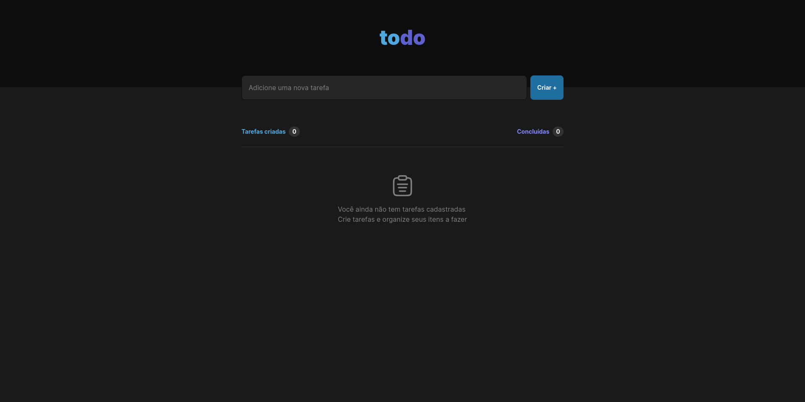
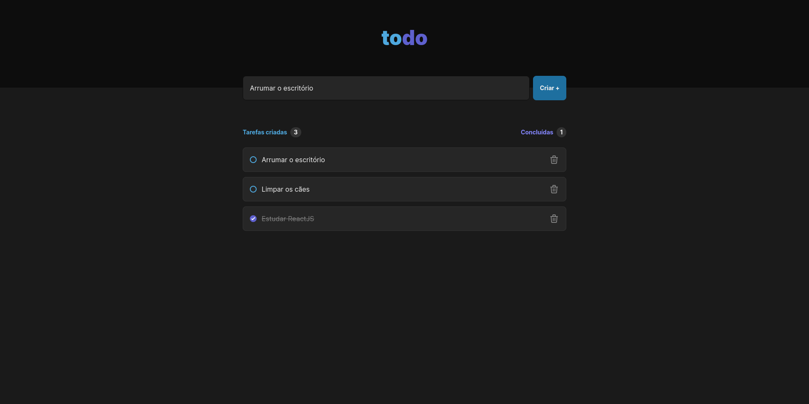

# To-Do List Web Application


Este é um aplicativo de lista de tarefas desenvolvido com Next.js, onde os usuários podem criar, excluir e marcar tarefas como concluídas. Inicializa algumas tarefas através do arquivo `data.ts` localizado na raiz do projeto, atuando como um mock.


## Screenshots

Aqui estão alguns screenshots do projeto:





## Clone e execução

Para clonar e executar este projeto localmente, siga estas instruções:

1. Clone o repositório:

```bash
git clone https://github.com/gildembergleite/todo-list-web.git
```

2. Navegue até o diretório do projeto:

```bash
cd todo-list-web
```

3. Instale as dependências:

```bash
npm install
# ou
yarn install
```

4. Inicie a aplicação:

```bash
npm run dev
# ou
yarn dev
```